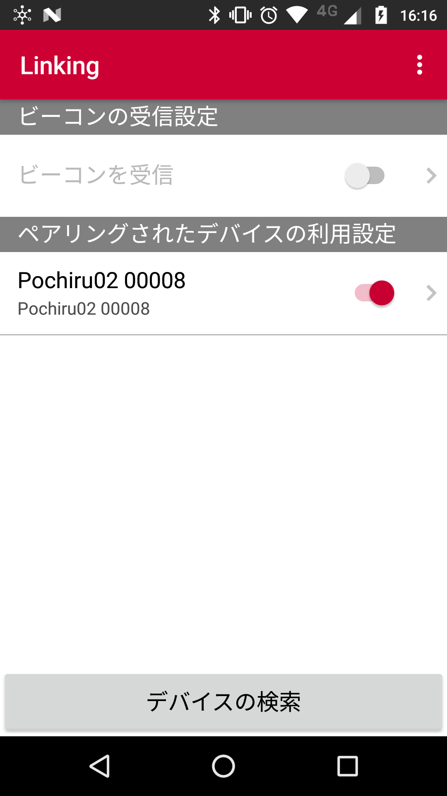
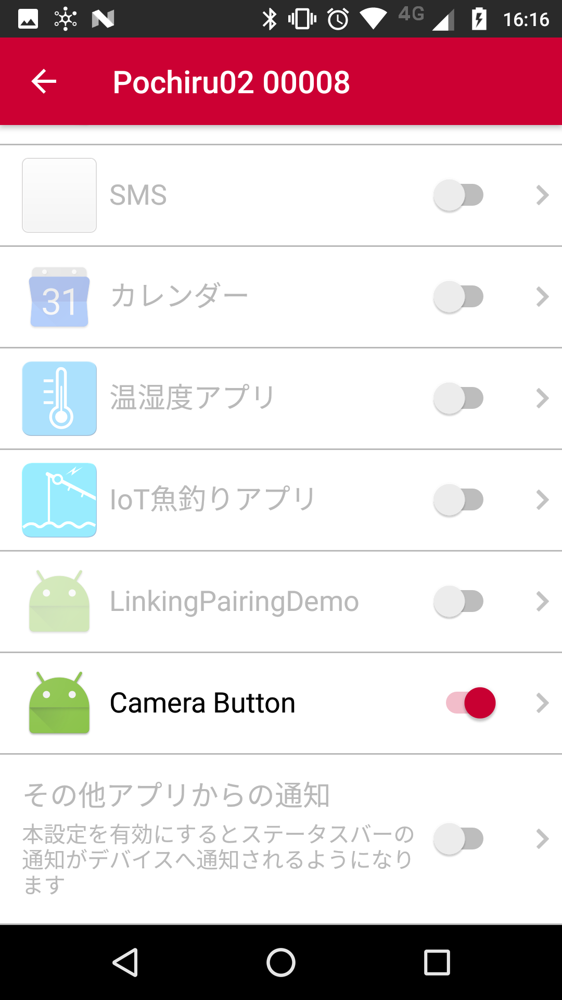
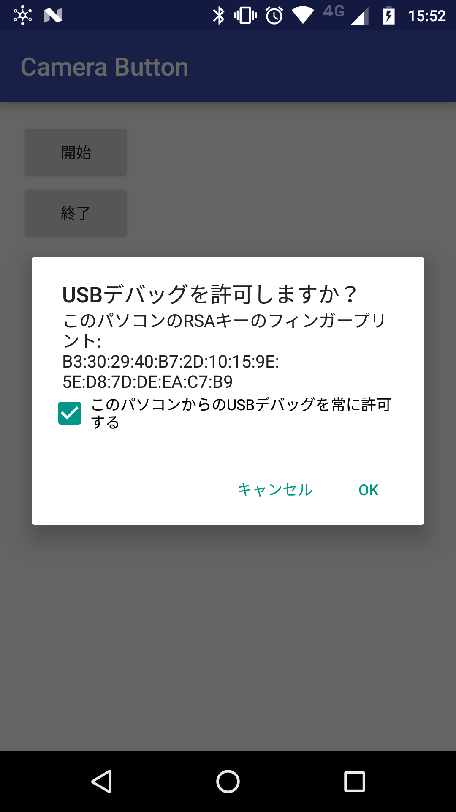

# CameraButton

 
[Project Linking](https://linkingiot.com/)対応デバイスの[Pochiru](https://ssl.braveridge.com/store/html/products/detail.php?product_id=30)
を使って、リモートでカメラのシャッターを切ることができるアプリです。

# 準備

まず、CameraButtonのアプリをインストールします。
[Linkingアプリ](https://play.google.com/store/apps/details?id=com.nttdocomo.android.smartdeviceagent)で[Pochiru](https://ssl.braveridge.com/store/html/products/detail.php?product_id=30)と連携しておきます。  
 

[Linkingアプリ](https://play.google.com/store/apps/details?id=com.nttdocomo.android.smartdeviceagent)のアプリ連携でCameraButtonをONにします。  
 

開発者モードをON、デバッグをONにして、端末とUSB接続し、 
<code>adb tcpip 5555</code> 
とコマンドを打って、adbをtcpipモードにしておく必要があります。

アプリを起動後に「開始」ボタンを押すと、 
 
の画面が出るので、「OK」を押します。

そしてカメラアプリを起動した状態でPochiruを押してください。

※<code>KEYCODE_CAMERA</code>を 
<code>/system/bin/input keyevent KEYCODE_CAMERA</code> 
で投げていますが、カメラアプリによっては反応しない場合があるかもしれません。

※他のアプリがフォアグラウンドの時にキーイベントを投げるため、[adb接続ライブラリ](https://github.com/cgutman/AdbLib)を使って、自分自身にadb接続しています。

